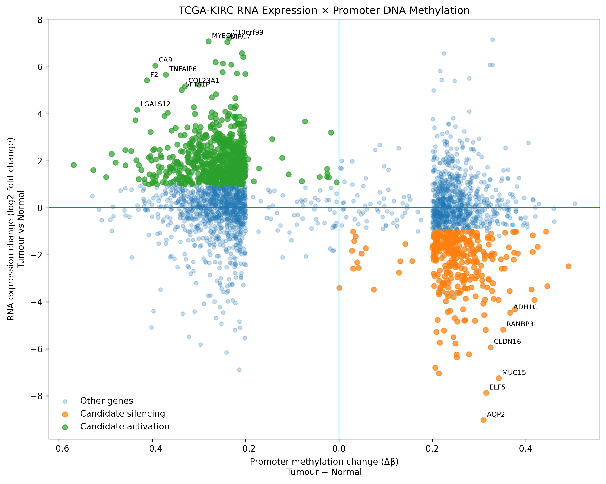
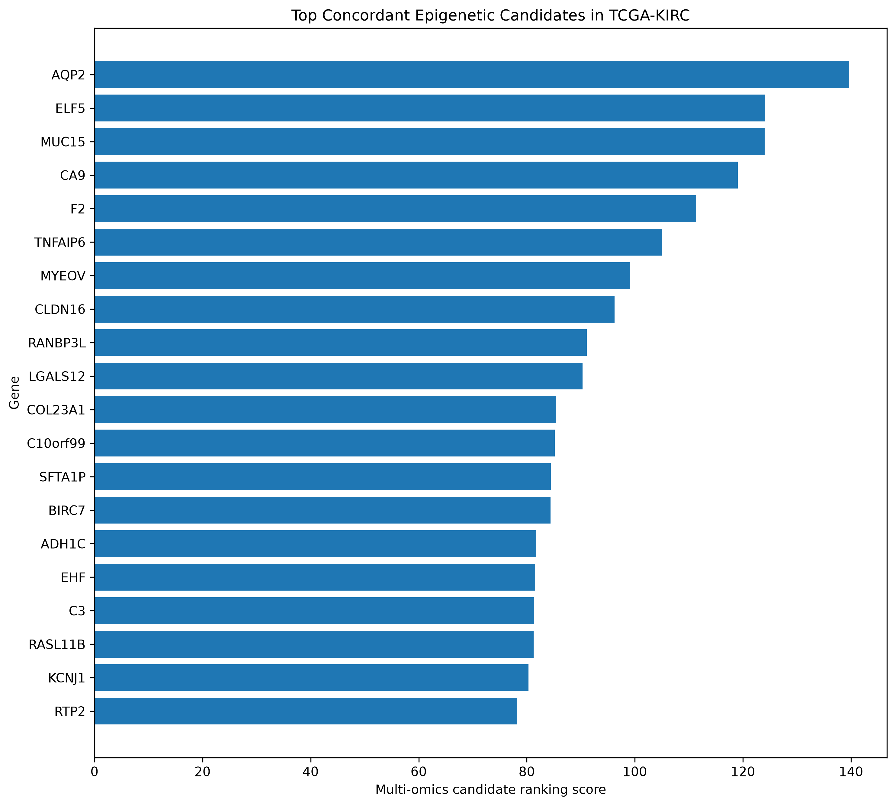
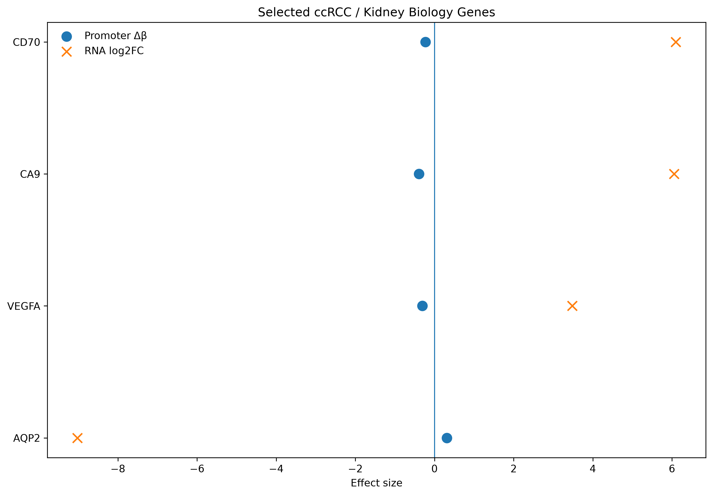
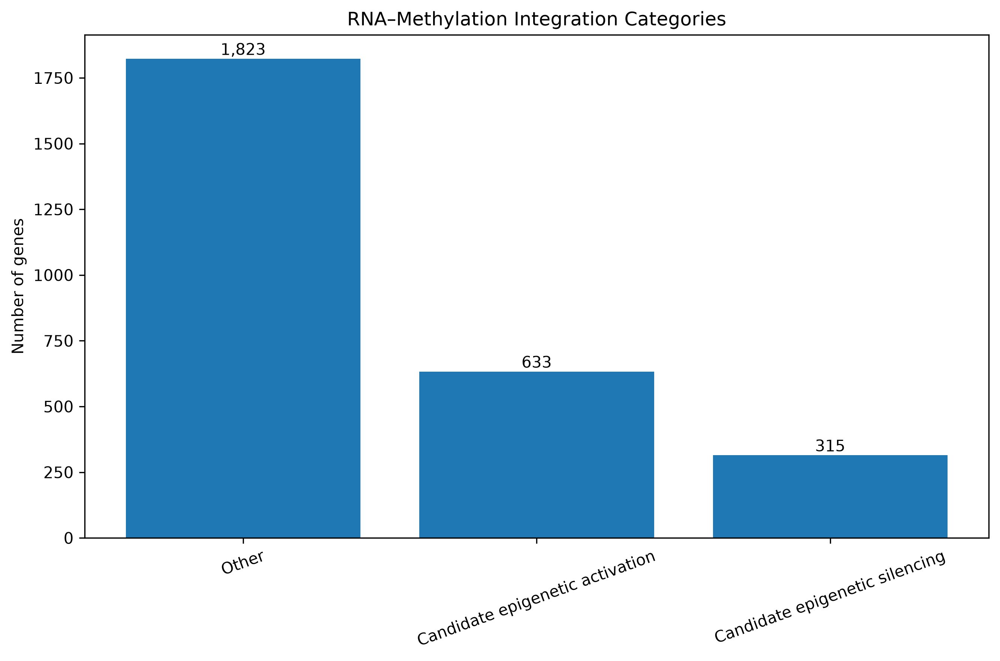

# TCGA-KIRC Clinical Multi-Omics Pipeline

A reproducible Python/Snakemake workflow for integrating *RNA-seq and Illumina 450K DNA methylation data* from TCGA Kidney Renal Clear Cell Carcinoma (TCGA-KIRC).

The project demonstrates end-to-end handling of large public biomedical datasets, including cohort discovery, validated data acquisition, quality control, differential analysis, genomic annotation, multi-omics integration, reproducible workflow orchestration and automated testing.

---

## Project overview

This pipeline investigates molecular differences between *clear-cell renal cell carcinoma (ccRCC) tumours and normal kidney tissue* using two complementary molecular layers:

- RNA sequencing
- DNA methylation

The workflow identifies transcriptional alterations, differential CpG methylation and genes showing concordant promoter-methylation/expression relationships.

---

## Key results

| Analysis | Result |
|---|---:|
| RNA-seq biological samples | 609 |
| Genes retained after RNA-seq QC | 32,942 |
| Significant differentially expressed genes | 14,343 |
| Upregulated genes | 10,960 |
| Downregulated genes | 3,383 |
| Methylation cohort | 345 biological samples |
| Methylation samples analysed after QC | 336 |
| CpGs tested | 403,952 |
| Significant differentially methylated positions | 19,979 |
| Hypermethylated DMPs | 8,377 |
| Hypomethylated DMPs | 11,602 |
| Genes integrated across RNA and methylation | 2,771 |
| Concordant epigenetic candidates | 948 |
| Strict candidate set | 909 |

---

## Multi-omics integration

Promoter DNA methylation changes were integrated with tumour-versus-normal RNA expression.

Two biologically interpretable concordant patterns were prioritised:

*Candidate epigenetic silencing*

Promoter hypermethylation accompanied by reduced RNA expression.

*Candidate epigenetic activation*

Promoter hypomethylation accompanied by increased RNA expression.

The analysis produced *948 concordant candidates, with **909 genes passing the stricter prioritisation criteria*.

Selected kidney/ccRCC-associated genes demonstrated expected cross-omics relationships, including *AQP2, CA9, CD70 and VEGFA*.

These associations are interpreted as being *compatible with epigenetic regulation* rather than establishing causal regulation.

---

## RNA-seq × methylation integration

---

## Top epigenetic candidates

---

## Selected ccRCC biology

---

## Integration categories

---

## Pipeline architecture

mermaid
flowchart TD
    A[TCGA-KIRC RNA-seq] --> B[Cohort discovery]
    B --> C[Checksum-validated acquisition]
    C --> D[Count matrix]
    D --> E[RNA-seq QC]
    E --> F[Differential expression]
    F --> G[Pathway enrichment]

    H[TCGA-KIRC 450K methylation] --> I[Cohort discovery]
    I --> J[Checksum-validated acquisition]
    J --> K[Beta-value matrix]
    K --> L[Methylation QC]
    L --> M[Differential methylation]
    M --> N[CpG / gene annotation]

    F --> O[RNA × methylation integration]
    N --> O

    O --> P[Concordant epigenetic candidates]
    P --> Q[Multi-omics visualisation]

---

## Pipeline stages

### RNA-seq

1. Discover TCGA-KIRC RNA-seq data
2. Prepare the biological cohort
3. Inspect and resolve technical duplicate aliquots
4. Download RNA-seq files
5. Build the gene-count matrix
6. Perform RNA-seq QC and filtering
7. Perform tumour-versus-normal differential expression
8. Generate differential-expression visualisations
9. Perform pathway enrichment and biological interpretation

### DNA methylation

10. Discover TCGA-KIRC methylation data
11. Compare available methylation platforms
12. Construct the RNA-overlapping Illumina 450K cohort
13. Perform checksum-validated data acquisition
14. Build the methylation beta-value matrix
15. Perform methylation QC and differential methylation
16. Annotate CpGs and link differential methylation to genes

### Multi-omics

17. Integrate promoter methylation with RNA expression
18. Prioritise concordant epigenetic candidates and generate visualisations

### Reproducibility and software engineering

19. Orchestrate downstream analyses with Snakemake
20. Validate project structure, Python syntax and workflow components using pytest

---

## Reproducible workflow

The computational workflow is defined in:

text
workflow/Snakefile

Configuration is separated from workflow logic:

text
config/workflow.yaml

A Snakemake dry run successfully validates the workflow dependency graph against completed analysis outputs.

Example:

bash
snakemake \
  --snakefile workflow/Snakefile \
  --configfile config/workflow.yaml \
  --cores 4 \
  --dry-run

Workflow documentation is available under:

text
docs/workflow/

---

## Automated testing

The repository contains automated tests covering:

- required project structure
- required analysis scripts
- Python syntax compilation
- Snakemake workflow presence
- expected workflow rules
- configuration availability

Run:

bash
pytest -v

Current status:

text
7 passed

---

## Data integrity and provenance

Large TCGA datasets are intentionally excluded from the repository.

The acquisition workflow includes:

- GDC API-based dataset discovery
- explicit cohort-selection logic
- MD5 checksum validation
- retry handling for network failures
- duplicate-sample detection
- download logging
- provenance records
- explicit sample metadata handling

This separates reproducible analysis code and provenance from large external biomedical datasets.

---

## Repository structure

text
KIRC-Clinical-Omics-Pipeline/
├── config/
│   └── workflow.yaml
├── docs/
│   ├── figures/
│   └── workflow/
├── scripts/
│   ├── 01_discover_rnaseq.py
│   ├── 02_prepare_rnaseq_cohort.py
│   ├── ...
│   ├── 14_build_methylation_matrix.py
│   ├── 15_differential_methylation.py
│   ├── 16_annotate_methylation.py
│   ├── 17_integrate_rna_methylation.py
│   └── 18_multiomics_visualisation.py
├── src/
├── tests/
├── workflow/
│   └── Snakefile
├── pyproject.toml
├── uv.lock
└── README.md

---

## Technologies

*Bioinformatics and data analysis*

Python, pandas, NumPy, PyDESeq2, scikit-learn, GSEApy and Matplotlib

*Workflow engineering*

Snakemake, pytest, uv and Git

*Data infrastructure*

NCI Genomic Data Commons API, Linux/WSL and Apache Parquet

*Analysis areas*

RNA-seq, DNA methylation, differential expression, differential methylation, genomic annotation, pathway enrichment and multi-omics integration

---

## Reproducibility

Dependencies are defined using:

text
pyproject.toml
uv.lock

The project was developed and executed under Linux/WSL using a version-controlled Git workflow.

---

## Scope

This repository is a computational portfolio and research workflow built using publicly available TCGA data.

It is intended to demonstrate reproducible bioinformatics pipeline development, large-scale biological data handling, quality control, statistical analysis, multi-omics integration and software-engineering practices.

Raw TCGA data are not distributed in this repository.
