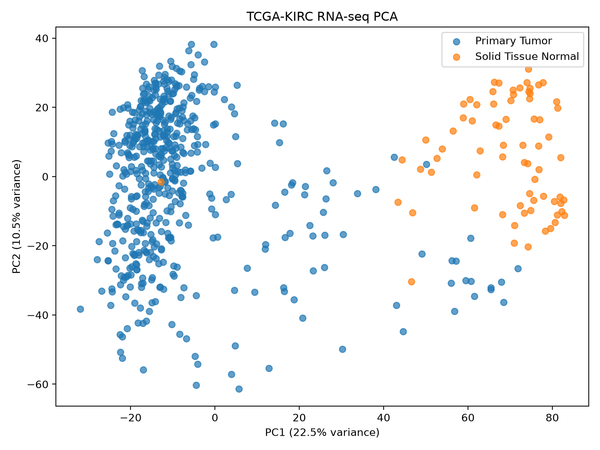
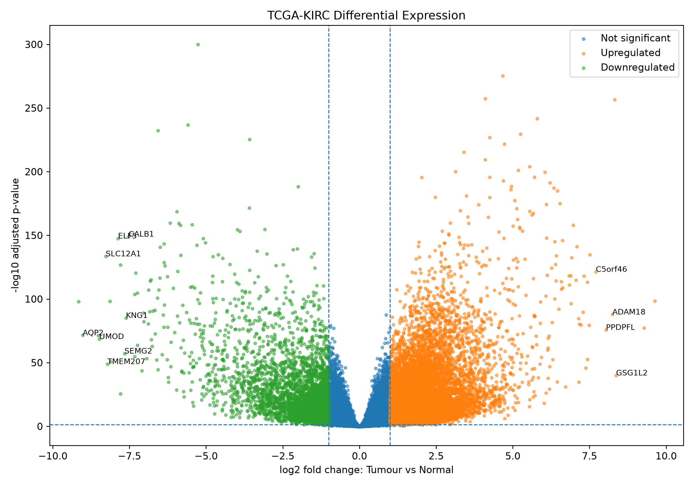
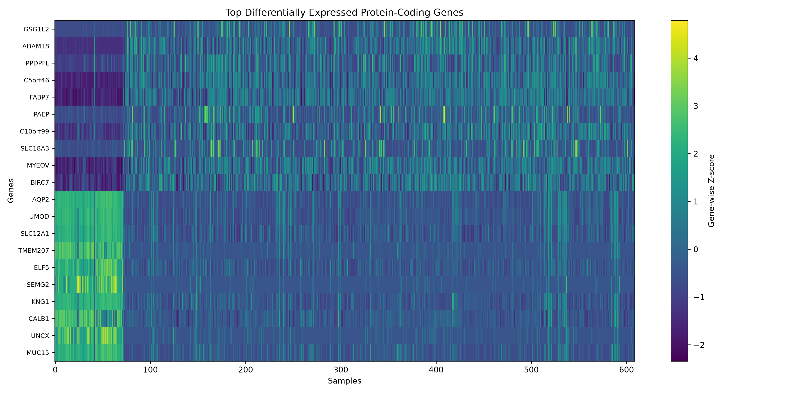

# KIRC Clinical Multi-Omics Pipeline

A reproducible functional-genomics workflow for analysing and integrating
transcriptomic and epigenomic data from TCGA clear-cell renal cell carcinoma
(TCGA-KIRC).

## Project aims

This project demonstrates reproducible cancer-genomics analysis across:

- bulk RNA-seq
- DNA methylation
- multi-omics sample integration
- biological interpretation
- programmatic data acquisition
- provenance and integrity checking

## Current workflow

### RNA-seq

- Programmatic TCGA-KIRC data discovery using the NCI GDC API
- 613 STAR-count files downloaded and MD5 validated
- Technical replicate identification and handling
- 609 biological RNA-seq samples retained
- 60,660-gene raw count matrix constructed
- Low-expression filtering
- Library-size and detected-gene QC
- PCA using highly variable genes
- Tumour-versus-normal differential expression using PyDESeq2
- GO, KEGG and Reactome pathway enrichment using GSEApy

### RNA-seq results

- 537 Primary Tumour samples
- 72 Solid Tissue Normal samples
- 32,942 genes retained after filtering
- 14,343 genes met FDR < 0.05 and |log2FC| >= 1
- 10,960 genes upregulated in tumour
- 3,383 genes downregulated in tumour

The analysis recovered established clear-cell renal carcinoma biology,
including increased expression of CA9, VEGFA, EGLN3, SLC2A1, FABP7 and CD70,
together with loss of differentiated renal programmes including UMOD,
SLC12A1 and AQP2.

### DNA methylation

- TCGA-KIRC methylation datasets discovered programmatically
- Illumina HumanMethylation450 selected for higher CpG coverage
- 347 methylation files downloaded with checksum validation
- 345 biological samples exactly matched to the RNA-seq cohort
- 486,427 CpG measurements available per sample
- Transcriptome-methylome integration is the next analysis stage

## Reproducibility

The project includes:

- Python analysis scripts
- Git version control
- pyproject.toml
- uv.lock
- structured configuration
- provenance records
- MD5 checksum validation
- explicit cohort-selection logic
- documented data-management practices

Large TCGA datasets are intentionally excluded from the repository.

## Technologies

Python | pandas | NumPy | PyDESeq2 | scikit-learn | GSEApy |
Matplotlib | NCI GDC API | Git | Linux/WSL | Parquet | uv

## Selected results

### RNA-seq PCA



### Tumour vs Normal Differential Expression



### Top Differentially Expressed Genes



## Repository structure

```text
KIRC-Clinical-Omics-Pipeline/
├── config/
├── docs/
│   └── figures/
├── scripts/
├── src/
├── tests/
├── app.py
├── pyproject.toml
├── uv.lock
└── README.md

```

## Project status

- RNA-seq analysis: complete
- Pathway enrichment: complete
- 450K methylation acquisition and matched-cohort construction: complete
- Differential methylation and RNA-methylation integration: in progress
- WGS workflow: planned extension
